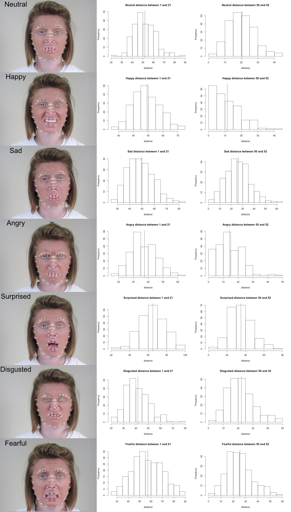

In your final repo, there should be an R markdown file that organizes **all computational steps** for evaluating your proposed Facial Expression Recognition framework. 

This file is currently a template for running evaluation experiments. You should update it according to your codes but following precisely the same structure. 

```{r message=FALSE}
r = getOption("repos")
r["CRAN"] = "http://cran.us.r-project.org"
options(repos = r)

if(!require("EBImage")){
  source("https://bioconductor.org/biocLite.R")
  biocLite("EBImage")
}
if(!require("R.matlab")){
  install.packages("R.matlab")
}
if(!require("readxl")){
  install.packages("readxl")
}

if(!require("dplyr")){
  install.packages("dplyr")
}
if(!require("readxl")){
  install.packages("readxl")
}

if(!require("ggplot2")){
  install.packages("ggplot2")
}

if(!require("caret")){
  install.packages("caret")
}

if(!require("e1071")){
  install.packages("e1071")
}

if(!require("gbm")){
  install.packages("gbm")
}

library(R.matlab)
library(readxl)
library(dplyr)
library(EBImage)
library(ggplot2)
library(caret)
library(rstudioapi)
library(e1071)
library(gbm)
```

### Step 0 set work directories
```{r wkdir}
set.seed(0)
setwd("C://Users//jessm//OneDrive//Documents//Columbia University//Fall 2019//STAT 5243 - Applied Data Science//Projects//Project 3//Project 3 - Final Submission - Copy//doc")
# here replace it with your own path or manually set it in RStudio to where this rmd file is located. 
# use relative path for reproducibility
```

Provide directories for training images. Training images and Training fiducial points will be in different subfolders. 
```{r}
train_dir <- "../data/train_set/" # This will be modified for different data sets.
train_image_dir <- paste(train_dir, "images/", sep="")
train_pt_dir <- paste(train_dir,  "points/", sep="")
train_label_path <- paste(train_dir, "label.csv", sep="") 
```

### Step 1: set up controls for evaluation experiments.

In this chunk, we have a set of controls for the evaluation experiments. 

+ (T/F) process features for training set
+ (T/F) run evaluation on an independent test set
+ (T/F) process features for test set

```{r exp_setup}
run.feature.train=TRUE # process features for training set
run.test=TRUE # run evaluation on an independent test set
run.feature.test=TRUE # process features for test set
```

### Step 2: import data and train-test split 
```{r}
#train-test split
info <- read.csv(train_label_path)
n <- nrow(info)
n_train <- round(n*(4/5), 0)
train_idx <- sample(info$Index, n_train, replace = F)
test_idx <- setdiff(info$Index,train_idx)
```

If you choose to extract features from images, such as using Gabor filter, R memory will be exhausted if all images are read together. The solution is to repeat reading a smaller batch(e.g 100) and process them. 
```{r}
n_files <- length(list.files(train_image_dir))

image_list <- list()
for(i in 1:100){
   image_list[[i]] <- readImage(paste0(train_image_dir, sprintf("%04d", i), ".jpg"))
}
```

Fiducial points are stored in matlab format. In this step, we read them and store them in a list.
```{r read fiducial points}
#function to read fiducial points
#input: index
#output: matrix of fiducial points corresponding to the index
readMat.matrix <- function(index){
     return(round(readMat(paste0(train_pt_dir, sprintf("%04d", index), ".mat"))[[1]],0))
}

#load fiducial points
fiducial_pt_list <- lapply(1:n_files, readMat.matrix)
save(fiducial_pt_list, file="../output/fiducial_pt_list.RData")
```

### Step 3: construct features and responses

+ The follow plots show how pairwise distance between fiducial points can work as feature for facial emotion recognition.

  + In the first column, 78 fiducials points of each emotion are marked in order. 
  + In the second column distributions of vertical distance between right pupil(1) and  right brow peak(21) are shown in  histograms. For example, the distance of an angry face tends to be shorter than that of a surprised face.
  + The third column is the distributions of vertical distances between right mouth corner(50)
and the midpoint of the upper lip(52).  For example, the distance of an happy face tends to be shorter than that of a face.



`feature.R` should be the wrapper for all your feature engineering functions and options. The function `feature( )` should have options that correspond to different scenarios for your project and produces an R object that contains features and responses that are required by all the models you are going to evaluate later. 
  
  + `feature.R`
  + Input: list of images or fiducial point
  + Output: an RData file that contains extracted features and corresponding responses

```{r feature}
source("../lib/featureBaseline.R")
tm_feature_trainBaseline <- NA
if(run.feature.train){
  tm_feature_trainBaseline <- system.time(dat_trainBaseline <- featureBaseline(fiducial_pt_list, train_idx))
}

tm_feature_testBaseline <- NA
if(run.feature.test){
  tm_feature_testBaseline <- system.time(dat_testBaseline <- featureBaseline(fiducial_pt_list, test_idx))
}

save(dat_trainBaseline, file="../output/feature_trainBaseline.RData")
save(dat_testBaseline, file="../output/feature_testBaseline.RData")

source("../lib/featureOurModel.R")
tm_feature_train <- NA
if(run.feature.train){
  tm_feature_train <- system.time(dat_train <- featureOurModel(fiducial_pt_list, train_idx))
}

tm_feature_test <- NA
if(run.feature.test){
  tm_feature_test <- system.time(dat_test <- featureOurModel(fiducial_pt_list, test_idx))
}

save(dat_train, file="../output/feature_trainOurModel.RData")
save(dat_test, file="../output/feature_testOurModel.RData")
```

### Step 4: Train a classification model with training features and responses
Call the train model and test model from library. 

`train.R` and `test.R` should be wrappers for all your model training steps and your classification/prediction steps. 

+ `train.R`
  + Input: a data frame containing features and labels and a parameter list.
  + Output:a trained model
+ `test.R`
  + Input: the fitted classification model using training data and processed features from testing images 
  + Input: an R object that contains a trained classifier.
  + Output: training model specification

+ In this Starter Code, we use KNN to do classification. 

* Train the model with the entire training set using the selected model (model parameter) via cross-validation.
```{r final_train}
load(file="../data/varImp.RData")
# # source("../lib/trainOurModel.R")
# 
# num_of_var <- c(50,100,150,200,250,300,350,400,450,500,550,600,650,700,750,800,850,900,950,1000)
# #,700,900,1200,1800,2400,3003)
# 
# acc = c()
# for(i in num_of_var){
# 
#   training <- dat_train %>% dplyr::select(b[1:i],emotion_idx)
# 
#   svm_model = svm(emotion_idx ~ ., data=training
#              , kernel = "linear", ranges = list(cost = c(.001,0.01,0,1,5,10,100)))
# 
#   predictionSVM <- predict(svm_model, dat_test[ , !(names(dat_test) %in% "emotion_idx")])
#   res = confusionMatrix(predictionSVM, dat_test$emotion_idx)
#   accuracy = res$overall[1]
#   acc = c(acc,accuracy)
# }
# 
# plot(num_of_var,acc,type = 'l')

source("../lib/trainBaseline.R")
tm_trainBaseline=NA
# tm_trainBaseline <- system.time(fitGBM <- trainBaseline(trainingData = dat_trainBaseline, desiredDistribution = "multinomial", desiredNumberOfTrees = 300, desiredShrinkage = 0.1, desiredInteractionDepth = 2, desiredNobs = 10, desiredCVFolds = 10))
tm_trainBaseline <- system.time(fitGBM <- trainBaseline(trainingData = dat_trainBaseline, desiredDistribution = "multinomial", desiredNumberOfTrees = 100))
save(fitGBM, file="../output/fit_trainBaseline.RData")

source("../lib/trainOurModel.R")
dat_train <- dat_train %>% dplyr::select(b[1:700], emotion_idx)
tm_train=NA
tm_train <- system.time(fitSVM <- trainOurModel(trainingData = dat_train, desiredKernel = "linear", desiredCostRange = list(cost = c(.001,0.01,0,1,5,10,100))))
save(fitSVM, file="../output/fit_trainOurModel.RData")
```

### Step 5: Run test on test images
```{r test}
source("../lib/testBaseline.R")
tm_testBaseline=NA
if(run.test){
  load(file="../output/fit_trainBaseline.RData")
  tm_testBaseline <- system.time(predictionGBM <- testBaseline(model = fitGBM, testingData = dat_testBaseline[ , !(names(dat_testBaseline) %in% "emotion_idx")]))
}

source("../lib/testOurModel.R")
tm_test=NA
if(run.test){
  load(file="../output/fit_trainOurModel.RData")
  tm_test <- system.time(predictionSVM <- testOurModel(model = fitSVM, testingData = dat_test[ , !(names(dat_test) %in% "emotion_idx")]))
}
```

* evaluation
```{r}
predictionGBM <- as.factor(apply(predictionGBM, 1, which.max))

accuBaseline <- mean(dat_testBaseline$emotion_idx == predictionGBM)
cat("The accuracy of baseline model: is", accuBaseline*100, "%.\n")
# confusionMatrix(predictionGBM, dat_test$emotion_idx)
# unique(predictionGBM)
# unique(dat_testBaseline$emotion_idx)

accu <- mean(dat_test$emotion_idx == predictionSVM)
cat("The accuracy of our model: is", accu*100, "%.\n")
# confusionMatrix(predictionSVM, dat_test$emotion_idx)
# unique(predictionSVM)
# unique(dat_test$emotion_idx)
```

Note that the accuracy is around 50% which is better than that of random guess(4.5%). 

### Summarize Running Time
Prediction performance matters, so does the running times for constructing features and for training the model, especially when the computation resource is limited. 
```{r running_time}
cat("Baseline: Time for constructing training features=", tm_feature_trainBaseline[1], "s \n")
cat("Baseline: Time for constructing testing features=", tm_feature_testBaseline[1], "s \n")
cat("Baseline: Time for training model=", tm_trainBaseline[1], "s \n")
cat("Baseline: Time for testing model=", tm_testBaseline[1], "s \n")

cat("Our Model: Time for constructing training features=", tm_feature_train[1], "s \n")
cat("Our Model: Time for constructing testing features=", tm_feature_test[1], "s \n")
cat("Our Model: Time for training model=", tm_train[1], "s \n")
cat("Our Model: Time for testing model=", tm_test[1], "s \n")
```

###Reference
- Du, S., Tao, Y., & Martinez, A. M. (2014). Compound facial expressions of emotion. Proceedings of the National Academy of Sciences, 111(15), E1454-E1462.
